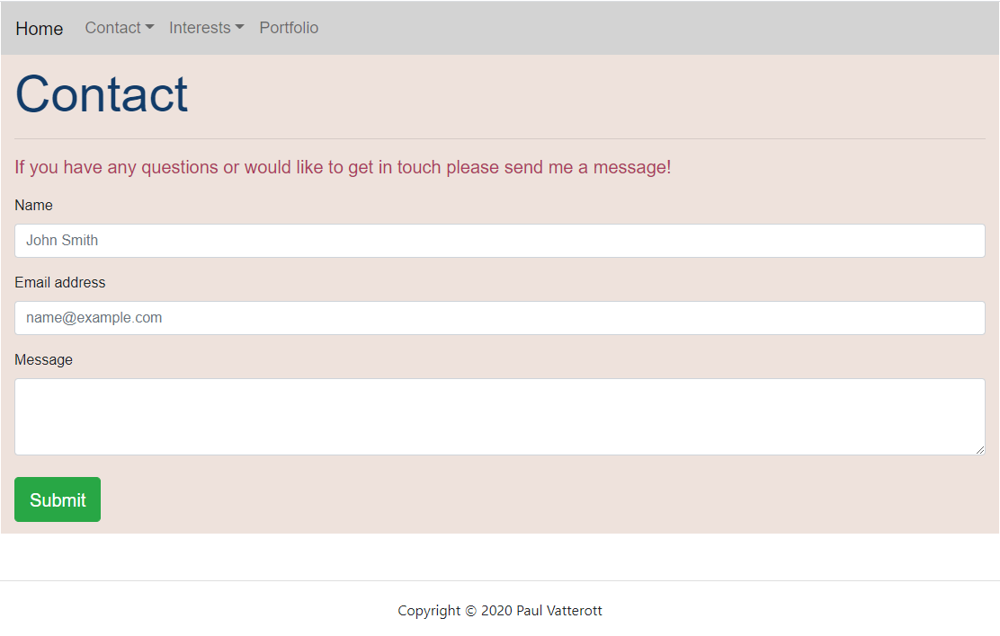
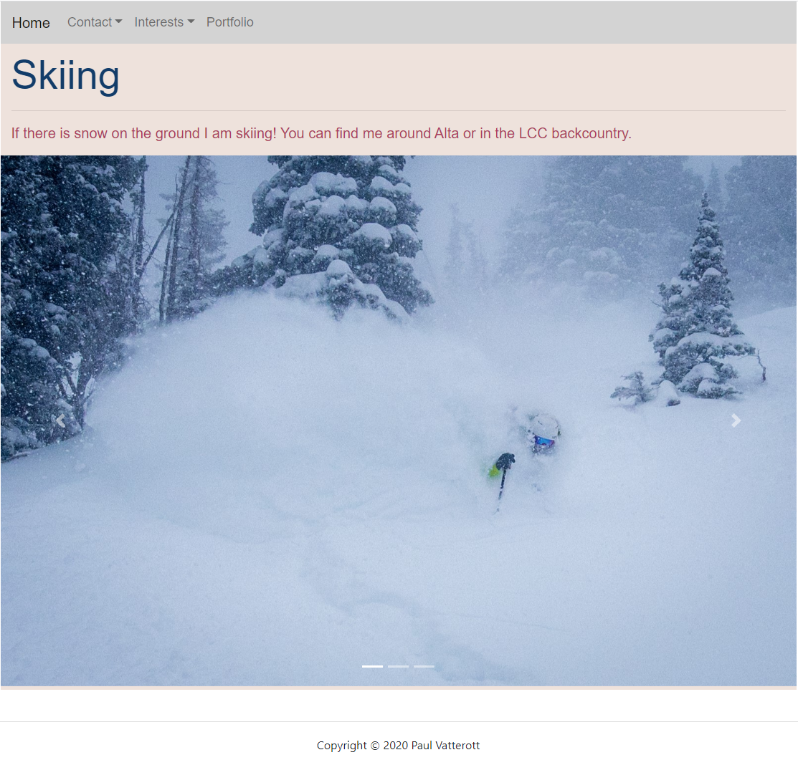

# Personal Portfolio Website    

## Description

For this project I used Bootstrap 4 to completely overhaul my personal portfolio. I learned many things in the process: the grid system, different Bootstrap components, how to have several pages for one website, and how to make a website responsive. 

This website features:

1. A navbar that is unchanged on every page.
2. Links to my email, github, and Instagram.
3. A sticky footer that is unchanged on every page.
4. A contact form (although it is not working).
5. Two different interest pages with functioning caruousels.
6. A portfolio page with five cards on it for each future project.
7. Customized color scheme and fonts.

## Installation

To view this website open up the index.html doc using your favorite web browser.

## Screenshot of Main Page

## Screenshot of Contact Page

## Screenshot of Biking Page

## Screenshot of Skiing Page

## Screenshot of Portfolio Page

## Contributing

Please feel free to offer any recommendations and to contribute yourself by forking the repository. 

## License

MIT License

Copyright (c) 2020 Paul Vatterott

Permission is hereby granted, free of charge, to any person obtaining a copy
of this software and associated documentation files (the "Software"), to deal
in the Software without restriction, including without limitation the rights
to use, copy, modify, merge, publish, distribute, sublicense, and/or sell
copies of the Software, and to permit persons to whom the Software is
furnished to do so, subject to the following conditions:

The above copyright notice and this permission notice shall be included in all
copies or substantial portions of the Software.

THE SOFTWARE IS PROVIDED "AS IS", WITHOUT WARRANTY OF ANY KIND, EXPRESS OR
IMPLIED, INCLUDING BUT NOT LIMITED TO THE WARRANTIES OF MERCHANTABILITY,
FITNESS FOR A PARTICULAR PURPOSE AND NONINFRINGEMENT. IN NO EVENT SHALL THE
AUTHORS OR COPYRIGHT HOLDERS BE LIABLE FOR ANY CLAIM, DAMAGES OR OTHER
LIABILITY, WHETHER IN AN ACTION OF CONTRACT, TORT OR OTHERWISE, ARISING FROM,
OUT OF OR IN CONNECTION WITH THE SOFTWARE OR THE USE OR OTHER DEALINGS IN THE
SOFTWARE.
