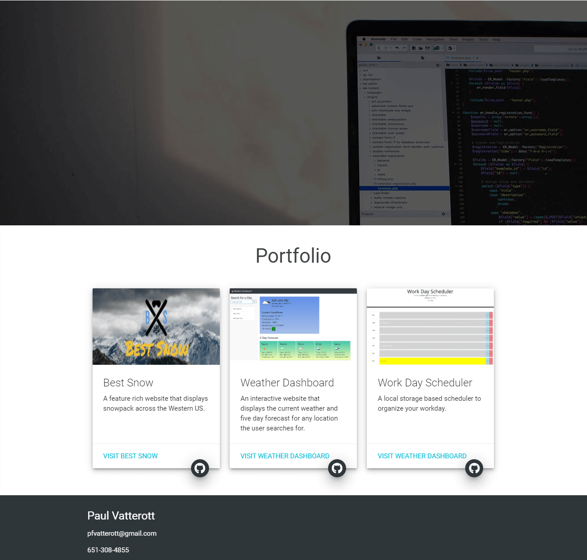

# Portfolio

This website's purpose is to demonstrate my abilities in creating a webpage while also showing the user my contact information and portfolio.

## Description

Some fun features of this website:

* A logo that fades out while scrolling down the page and fades back in when scrolling up
* A resume displayed as a png that is also downloadable as a pdf
* Scollspy for links in navbar
* A collapsible navbar for mobile browsing
* Lots of FABs featuring Font Awesome Icons
* Cards presenting my various projects
* Hover effects
* Tooltips for all buttons

## Built With
* [Materialize CSS](https://materializecss.com/)
* [JQuery](https://jquery.com/)
* [Font Awesome](https://fontawesome.com/)
* [Favicon](https://favicon.io/)

## Link to Site

[Click to access my Portfolio!](https://pfvatterott.github.io/)

## Screenshots

## Authors

### Paul Vatterott
[Github](https://github.com/pfvatterott)  
Email: pfvatterott@gmail.com

## License
MIT License

Copyright (c) 2021 Paul Vatterott Ryan Hadfield Asher Pappas Ron Edmonds

Permission is hereby granted, free of charge, to any person obtaining a copy of this software and associated documentation files (the "Software"), to deal in the Software without restriction, including without limitation the rights to use, copy, modify, merge, publish, distribute, sublicense, and/or sell copies of the Software, and to permit persons to whom the Software is furnished to do so, subject to the following conditions:

The above copyright notice and this permission notice shall be included in all copies or substantial portions of the Software.

THE SOFTWARE IS PROVIDED "AS IS", WITHOUT WARRANTY OF ANY KIND, EXPRESS OR IMPLIED, INCLUDING BUT NOT LIMITED TO THE WARRANTIES OF MERCHANTABILITY, FITNESS FOR A PARTICULAR PURPOSE AND NONINFRINGEMENT. IN NO EVENT SHALL THE AUTHORS OR COPYRIGHT HOLDERS BE LIABLE FOR ANY CLAIM, DAMAGES OR OTHER LIABILITY, WHETHER IN AN ACTION OF CONTRACT, TORT OR OTHERWISE, ARISING FROM, OUT OF OR IN CONNECTION WITH THE SOFTWARE OR THE USE OR OTHER DEALINGS IN THE SOFTWARE.

